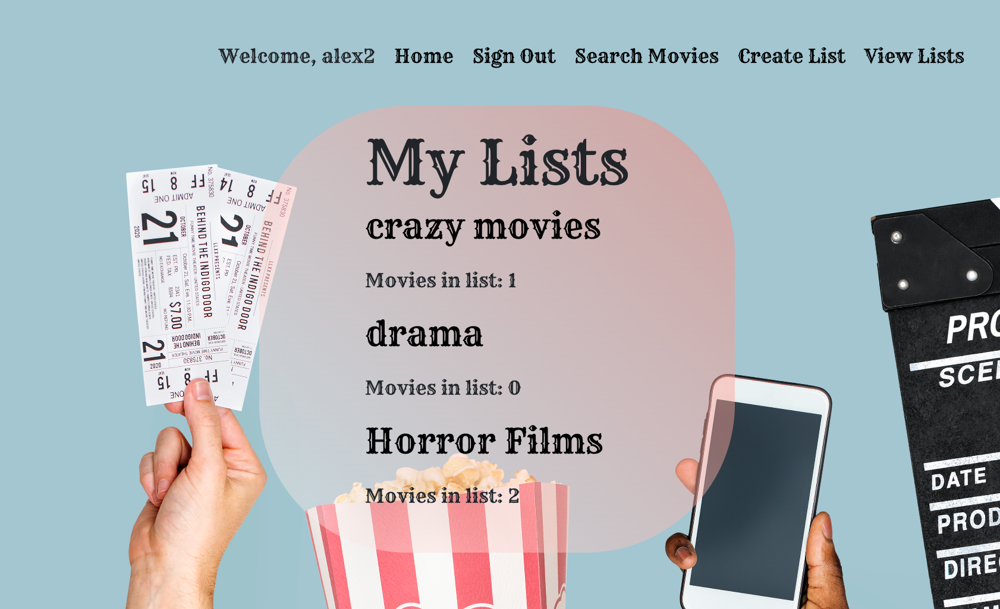
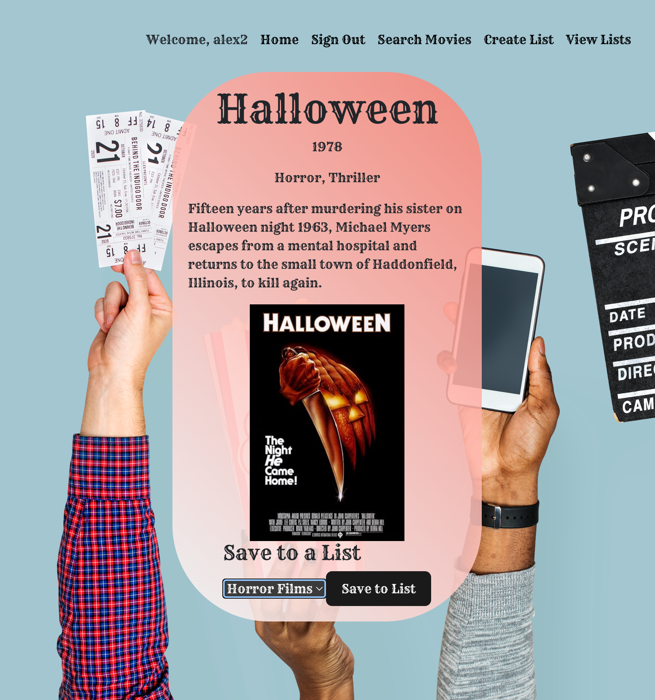
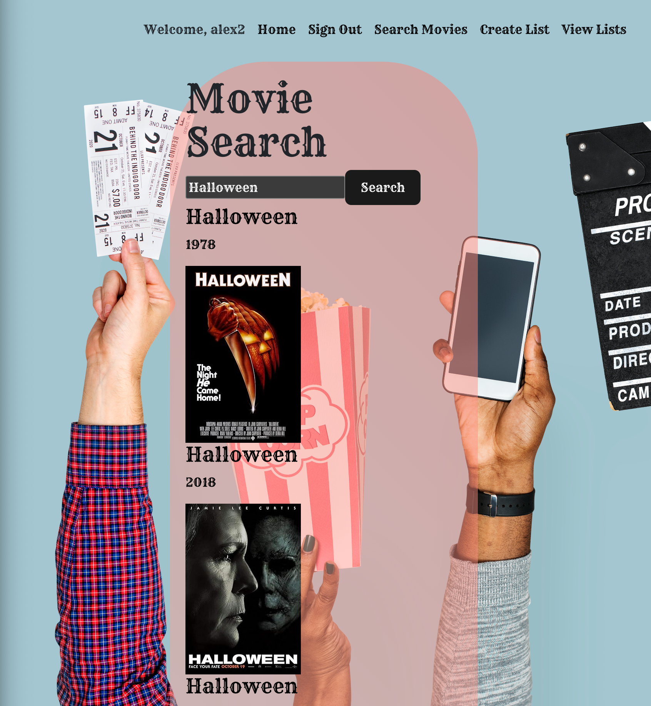

# Are You Not Entertained?
A user generated movie database

Link to the app:

1. Back Story: Are you a fan of movies and tv shows? Because we are!, and with this user generated list you can now track all of you favorite movies and tv shows you love, all in one place.

2. Getting Started:

    A. Sign-Up:

        If you are a first time user click the "sign-up" link, then create a username and password.

    B. Sign-In:

        If you are a returning user click the "sign-in" link and enter you current username and password.

    C. Add Title:

        Click the "Add Title" Button to manually add a title to your list.

    D. Search Title:

        Allows the user to "Search for a Title" and add title to the list.

    E. Edit Title:

        Allows the user to edit the details of the selected title.

    F. Delete Title:

        Allows the user to delete the selected title.

3. Attributions:

    ReadMe Image: Photo by Tima Miroshnichenko: https://www.pexels.com/photo/a-group-of-people-watching-movie-7991318/

    https://www.freepik.com/free-photo/hand-holding-entertainment-objects-isolated_18417013.htm#fromView=search&page=1&position=4&uuid=ec571042-87db-4b3d-accd-534aecf0aedc&query=movies

4. Coding Languages and Technologies Used:

    1. Bcrypt
    2. Cors
    3. Dotenv
    4. Express
    5. Jsonwebtoken
    6. Mongoose
    7. Morgan
    8. Method-Override
    9. Ejs
    10. Express-session
    11. Node-fetch
    12. React 
    13. Router
    14. Bootstrap
    15. Dom
    16. React-Bootstrap

5. Screeshots:

6. Future Endeavors:

    A. Further Styling for buttons (location, color, ect.)

    B. Adding audio, for a more interactive experience.

    C. Better compatibility for mobile devices

    D. Add a "True User Dashboard"